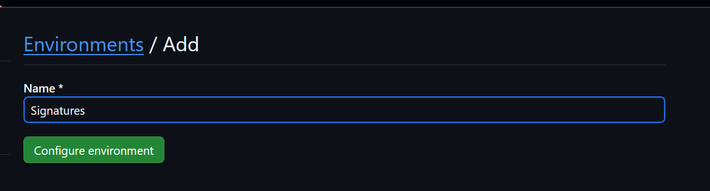
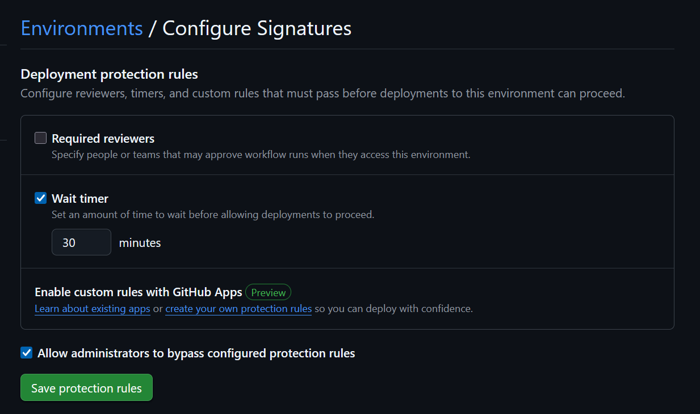

# actions
Github actions for various code signing tasks.

## Summary
The **ossign/actions/workflow/dispatch** action is primarily for those who have our code signing service. This workflow will submit a request to build and/or sign a binary for your project, you will need a username and key to use it to send the requests. You will be provided the credentials when your application is approved.

The **ossign/actions/setup-ossign** action belongs to our [open source signing tool (ossign/ossign)](https://github.com/ossign/ossign), for more information regarding this visit the repository readme.

## workflow/dispatch
Use this action to trigger code signing workflows in your repository, wait for completion, and retrieve signed artifacts. You need to have a pre-existing OSSign repository set up for your project, including credentials, to use this action.
Since the signature process requires manual approval, there are two choices for waiting for completion:

### Returns
- `finished`: "true" if the signing is complete, "false" otherwise.
- `workflow_id`: The ID of the triggered workflow run. Useful if you want to implement your own waiting/checking mechanism.
- `signed_artifacts`: A json string of the signing artifacts, e.g. 
```json
[
  {
    "id": 1234567890,
    "name": "my-signed-file.exe",
    "url": "https://api.github.com/repos/owner/repo/actions/artifacts/1234567890/zip",
    "browser_download_url": "https://github.com/owner/repo/actions/artifacts/1234567890/download",
  }
]
```


### Polling/Live Wait
This will keep the workflow running until the signing is complete. Do **not** use this on paid runners, since the runner will be occupied and incur charges for the entire waiting period. This one is mostly suitable for public, free workflows.
This action will trigger the build and sign workflow from the current branch, meaning if you run it from `main` the resulting workflow will fetch the code from `main`, `1.2.0` will fetch from `1.2.0`, etc.

Example:
```yaml
on:
  push:
    tags:
      - 'v*.*.*'

jobs:
  build:
    runs-on: ubuntu-latest
    steps:
      - uses: actions/checkout@v3
      
      - uses: ossign/actions/workflow/dispatch@main
        id: dispatch
        with:
          username: ${{ secrets.TEST_USERNAME }}
          token: ${{ secrets.TEST_TOKEN }}
      
      - run: |
          echo "Signed artifacts: ${{ steps.dispatch.outputs.signed_artifacts }}"


```

### Dispatch/Sleep/Check
This type will first dispatch the signing workflow, then use environments to sleep for a while (e.g. 30 minutes) and then run a check action to see if the signing is complete.

First, set up an environment on your repository called "Signatures" (or any name you prefer, just make sure to use the same name in the workflow).

Then, add a new environment:




Then, add a mandatory waiting period for running workflows in this environment (e.g. 30 minutes).



Create the first workflow file like this:

```yaml
# dispatch.yml
on:
  push:
    tags:
      - 'v*.*.*'

jobs:
  build:
    runs-on: ubuntu-latest
    permissions:
      # Needs actions: write to be able to dispatch workflows
      actions: write
      contents: read
    steps:
      - uses: actions/checkout@v3
      
      - uses: ossign/actions/workflow/dispatch@main
        id: dispatch
        with:
          username: ${{ secrets.TEST_USERNAME }}
          token: ${{ secrets.TEST_TOKEN }}
          dispatch_only: true
    
      - run: |
          echo "Received workflow ID: ${{ steps.dispatch.outputs.workflow_id }}"
    
      - name: Start the waiting loop
        uses: benc-uk/workflow-dispatch@v1
        with:
          workflow: waiting-loop.yml
          inputs: |
            { "workflow_id": "${{ steps.dispatch.outputs.workflow_id }}" }
```

Then, create a second workflow file like this. It will repeat and call itself until the signing is complete or the maximum number of attempts is reached, and it will wait the time you set in the environment between each attempt.

```yaml
# waiting-loop.yml
on:
  workflow_dispatch:
    inputs:
      workflow_id:
        description: 'The workflow ID from dispatch'
        required: true
        type: string
      attempt:
        required: false
        description: 'The attempt number'
        type: number
        default: 1
      max_attempts:
        required: false
        description: 'The maximum number of attempts (times the waiting period duration you set in the environment gives the max wait time, e.g. 30 minutes * 48 = 24 hours)'
        type: number
        default: 100

jobs:
    wait-and-check:
        runs-on: ubuntu-latest
        environment: Signatures
        permissions:
          # Needs actions: write to be able to dispatch workflows
          actions: write
          contents: read
        steps:
          - name: Check if the threshold has been reached
            shell: bash
            run: |
                if [ ${{ github.event.inputs.attempt }} -gt ${{ github.event.inputs.max_attempts }} ]; then
                  echo "Maximum number of attempts reached, exiting."
                  exit 1
                fi
        
          - name: Check if signing is finished
            id: check
            uses: ossign/actions/workflow/dispatch@main
            with:
              username: ${{ secrets.TEST_USERNAME }}
              token: ${{ secrets.TEST_TOKEN }}
              single_check: ${{ github.event.inputs.workflow_id }}
        
          - name: If artifacts were returned, we are done!
            if: steps.check.outputs.signed_artifacts != ''
            run: |
               echo "Signing complete, signed artifacts: ${{ steps.check.outputs.signed_artifacts }}"

          - name: Increase attempt counter
            if: steps.check.outputs.signed_artifacts == ''
            id: increased
            run: |
              echo "Attempt ${{ github.event.inputs.attempt }} failed, will try again."
              echo "attempt_no=$(( ${{ github.event.inputs.attempt }} + 1 ))" >> $GITHUB_OUTPUT

          - name: If signing is not finished, restart the workflow
            if: steps.check.outputs.signed_artifacts == ''
            uses: benc-uk/workflow-dispatch@v1
            with:
              workflow: waiting-loop.yml
              inputs: |
                { 
                    "workflow_id": "${{ github.event.inputs.workflow_id }}",
                    "attempt": "${{ steps.increased.outputs.attempt_no }}"
                }

```


## setup-ossign
Use this action to set up the OSSign binary in your workflow. It will download and install the OSSign CLI tool, and configure it with your credentials.
Example:
```yaml
on:
  push:
    tags:
      - 'v*.*.*'
jobs:
  build:
    runs-on: ubuntu-latest
    steps:
      - uses: actions/checkout@v3
      - uses: ossign/actions/setup-ossign@main
        with:
          # Required to fetch the binary
          # only needs read access to public repos
          token: ${{ secrets.GITHUB_TOKEN }}

          # Set the OSSign config on the server. Can be set to an empty string if you want to provide this via the -c flag on run
          ossignConfig: |
            {
                "tokenType": "azure",
                "azure": {
                    "vaultUrl": ""
                    "tenantId": "",
                    "clientId": "",
                    "clientSecret": "",
                    "certificateName": "",
                    "certificateVersion": ""
                },
                "certificate": {
                    "certificate": "",
                    "privateKey": ""
                },
                "timestampUrl": "http://timestamp.globalsign.com/tsa/advanced",
                "msTimestampUrl": "http://timestamp.microsoft.com/tsa"
            }

      - run: |
          ossign --sign-type msi filetosign.msi --output signedfile.msi
```

